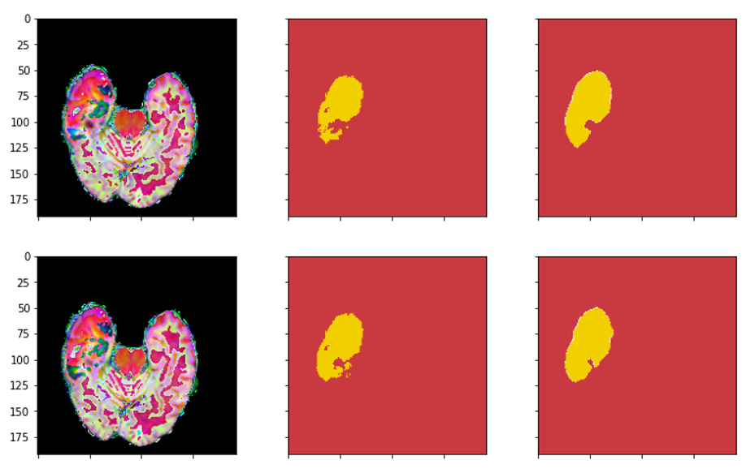

# Brain-Tumor-Segmentation-in-MRI
Deep learning has revolutionized medical imaging by providing accurate and reliable diagnosis in a short amount of time. One of the most common medical imaging modalities used to detect brain tumors is Magnetic Resonance Imaging (MRI). However, it can be challenging to accurately detect and segment tumors from MRI images due to the complex and heterogeneous nature of the brain.

To address this challenge, we used U-Net, a popular deep learning architecture, to accurately segment brain tumors from MRI images. Our aim was to develop an automated system that can accurately detect and segment brain tumors from MRI images, which can save time and improve diagnosis accuracy.

The powerpoint of this project is provided.
# Usage

## Dataset
The [BraTs 2015](https://www.kaggle.com/datasets/andrewmvd/brain-tumor-segmentation-in-mri-brats-2015) dataset is used in this project.

## The following packages are required:

- SimpleITK
- tqdm
- numpy
- matpoltlib
- torch
- torchvision
- PIL
- Keras
- cv2

## Data Pre-processing
1. *Resized the image*

    Data  format(types x height x width x slices): 
    4 x 240 x 240 x 155 -> 4 x 192 x 192 x 90 

2. *Transfered data type*
    .mha to .npy

3. *Image Smoothing*

    Applied image smoothing to dataset

4. *Label Pre-processing*

    Used One-hot encoding

## Model

Implemented Unet [[Original paper](https://arxiv.org/abs/1505.04597)]

## Result

The images in the middle is the actual position of the tumors, the images in the right in the prediction of our model.

  

# Credits
This project was cooperated by [Kevin/ Ping-Sung](https://github.com/Ping-Sung) and [Jamie/ Chieh-Ying](
https://github.com/jamie870116).

Please feel free to contect [me](kevin0925.academic@gmail.com) for any further questions.

# License
This project is licensed under the [MIT License](https://opensource.org/licenses/MIT).